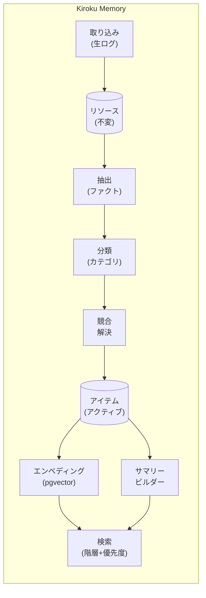

# Kiroku Memory

> AI エージェント向け階層検索メモリシステム

<p align="center">
  
</p>

[](https://www.python.org/downloads/)
[](https://fastapi.tiangolo.com/)
[](https://www.postgresql.org/)
[](https://surrealdb.com/)
[](https://opensource.org/licenses/MIT)

**言語**: [English](README.md) | [繁體中文](README.zh-TW.md) | [日本語](README.ja.md)

AI エージェント向けの本番環境対応メモリシステムです。永続的で進化するメモリと階層的な検索を実装しています。Rohit の「How to Build an Agent That Never Forgets」とコミュニティのフィードバックに基づいて構築されています。

## なぜこのプロジェクト？

従来の RAG（Retrieval-Augmented Generation）は、大規模運用時に根本的な課題に直面します：

- **意味的類似性 ≠ 事実の正確性**：エンベディングは類似性を捉えますが、正確性は捉えません
- **時間的コンテキストの欠如**：「ユーザーは以前 A が好きだったが、今は B を好む」という状況を処理できません
- **メモリの矛盾**：時間とともに蓄積された情報が矛盾する可能性があります
- **スケーラビリティの問題**：数万件のメモリで検索パフォーマンスが低下します

本システムは **Hybrid Memory Stack（ハイブリッドメモリスタック）** アーキテクチャでこれらの課題に対処します。

## なぜメモリが重要か：専門家の視点

AI エージェントと認知科学の第一人者が、永続的なメモリの重要性を強調しています：

### Lilian Weng（OpenAI リサーチサイエンティスト）

彼女の影響力のある記事 *"LLM Powered Autonomous Agents"* で、メモリをコアコンポーネントとして特定：

> メモリにより、エージェントはステートレスなやり取りを超え、セッション間で知識を蓄積できます。

Kiroku は **Tiered Retrieval（階層検索）** でこれを実現 — まずサマリー、次にドリルダウン — ナイーブな RAG の意味的ドリフト問題を回避。

### Harrison Chase（LangChain 創設者）

エージェントメモリの 3 つの層を提唱：**Episodic**（エピソード）、**Semantic**（意味）、**Procedural**（手続き）。

| LangChain コンセプト | Kiroku 実装 |
|---------------------|------------|
| Episodic | `events` カテゴリ |
| Semantic | `facts`、`preferences` カテゴリ |
| Procedural | `skills` カテゴリ |

追加価値：**Conflict Resolution** が矛盾するファクトを自動検出、**クロスプロジェクト共有** は `global:user` スコープで実現。

### Daniel Kahneman（ノーベル賞受賞者、認知心理学者）

『ファスト＆スロー』より — システム 1（直感）vs システム 2（分析）。

**Kiroku の実装：**

| モード | 機能 | メリット |
|--------|------------|---------|
| システム 1 | コンテキスト自動ロード | Claude が即座に「あなたを知っている」 |
| システム 2 | `/remember` コマンド | 重要情報を明示的にマーク |

**実際の効果**：毎回「Python は uv で管理したい」と言う必要がなくなります。

### コアバリュー

これらの専門家の見解は一つの洞察に収束します：**メモリが AI を「ツール」から「パートナー」に変える**。

- **継続性** — 会話が孤立した島ではなくなる
- **パーソナライゼーション** — AI が本当に「あなたを知る」
- **効率性** — コンテキストを再説明する認知的オーバーヘッドを排除
- **進化** — メモリが蓄積し、AI が時間とともに賢くなる

## 機能

- **追記専用の生ログ**：不変の来歴追跡
- **アトミックファクト抽出**：LLM による構造化ファクト抽出（主語-述語-目的語）
- **カテゴリベースの整理**：進化するサマリーを持つ 6 つのデフォルトカテゴリ
- **階層的検索**：まずサマリー、必要に応じてファクトに掘り下げ
- **競合解決**：矛盾するファクトの自動検出とアーカイブ
- **時間減衰**：メモリの信頼度が時間とともに指数関数的に減衰
- **ベクトル検索**：pgvector による意味的類似性検索
- **ナレッジグラフ**：エンティティ間の関係マッピング
- **スケジュールメンテナンス**：毎日、毎週、毎月のメンテナンスジョブ
- **本番環境対応**：構造化ログ、メトリクス、ヘルスチェック

## アーキテクチャ



## デスクトップアプリ

Kiroku Memory を最も簡単に使う方法 — Docker も Python セットアップも不要。

### ダウンロード

[GitHub Releases](https://github.com/yelban/kiroku-memory/releases) からお使いのプラットフォーム用の最新リリースをダウンロード：

| プラットフォーム | アーキテクチャ | フォーマット |
|-----------------|---------------|-------------|
| macOS | Apple Silicon (M1/M2/M3) | `.dmg` |
| macOS | Intel | `.dmg` |
| Windows | x86_64 | `.msi` |
| Linux | x86_64 | `.AppImage` |

### 使用方法

1. **インストール**：ダウンロードしたファイルをダブルクリックしてインストール
2. **起動**：アプリケーションから「Kiroku Memory」を起動
3. **設定**（オプション）：設定アイコンをクリックして OpenAI API キーを追加（セマンティック検索用）

#### macOS：初回起動（未署名アプリ）

このアプリは Apple Developer 証明書で署名されていません。初回起動時、macOS Gatekeeper がブロックします：

> 「Kiroku Memory」は、開発元を検証できないため開けません。

**アプリを許可する方法：**

**方法1：右クリックで開く**
1. **Kiroku Memory.app** を右クリック（または Control + クリック）
2. コンテキストメニューから「**開く**」を選択
3. ダイアログで「**開く**」をクリック

**方法2：システム設定**
1. 「**システム設定**」→「**プライバシーとセキュリティ**」を開く
2. 下にスクロールしてブロックされたアプリのメッセージを見つける
3. 「**このまま開く**」をクリック
4. 求められた場合はパスワードを入力

一度許可すれば、以降は通常通り開けます。

デスクトップアプリは組み込みの SurrealDB を使用 — すべてのデータはローカルに保存され、外部依存は不要です。

### 特徴

- **設定不要**：Docker やデータベースのセットアップなしで、すぐに使用可能
- **組み込みデータベース**：SurrealDB がアプリデータディレクトリにデータを保存
- **クロスプラットフォーム**：macOS、Windows、Linux 用のネイティブアプリ
- **同じ API**：`http://127.0.0.1:8000` で完全な REST API を利用可能

---

## クイックスタート（開発者向け）

ソースからの実行やシステムのカスタマイズを希望する開発者向け。

### 前提条件

- Python 3.11+
- Docker（PostgreSQL + pgvector 用）**または** SurrealDB（組み込み、Docker 不要）
- OpenAI API キー

> **初めてのインストール？** 詳しい手順については[インストールガイド](docs/installation-guide.ja.md)をご覧ください。

### インストール

```bash
# リポジトリをクローン
git clone https://github.com/yelban/kiroku-memory.git
cd kiroku-memory

# uv で依存関係をインストール
uv sync

# 環境変数ファイルをコピー
cp .env.example .env

# .env を編集して OPENAI_API_KEY を設定
```

### サービスの起動

#### オプション A：PostgreSQL（本番環境）

```bash
# PostgreSQL + pgvector を起動
docker compose up -d

# API サーバーを起動
uv run uvicorn kiroku_memory.api:app --reload

# API は http://localhost:8000 で利用可能
```

#### オプション B：SurrealDB（デスクトップ/組み込み、Docker 不要！）

```bash
# .env でバックエンドを設定
echo "BACKEND=surrealdb" >> .env

# API サーバーを起動（Docker 不要！）
uv run uvicorn kiroku_memory.api:app --reload

# データは ./data/kiroku/ に保存
```

### インストールの確認

```bash
# ヘルスチェック
curl http://localhost:8000/health
# 期待される応答: {"status":"ok","version":"0.1.0"}

# 詳細なヘルスステータス
curl http://localhost:8000/health/detailed
```

## 使用方法

### 基本的なワークフロー

#### 1. メッセージの取り込み

```bash
curl -X POST http://localhost:8000/ingest \
  -H "Content-Type: application/json" \
  -d '{
    "content": "私の名前は田中で、Google でソフトウェアエンジニアとして働いています。Neovim を使うのが好きです。",
    "source": "user:tanaka",
    "metadata": {"channel": "chat"}
  }'
```

#### 2. ファクトの抽出

```bash
curl -X POST http://localhost:8000/extract \
  -H "Content-Type: application/json" \
  -d '{"resource_id": "YOUR_RESOURCE_ID"}'
```

これにより以下のような構造化ファクトが抽出されます：
- `田中` `勤務先` `Google`（カテゴリ：facts）
- `田中` `職業` `ソフトウェアエンジニア`（カテゴリ：facts）
- `田中` `好み` `Neovim`（カテゴリ：preferences）

#### 3. サマリーの生成

```bash
curl -X POST http://localhost:8000/summarize
```

#### 4. メモリの検索

```bash
# 階層的検索（サマリー + アイテム）
curl "http://localhost:8000/retrieve?query=田中さんの仕事は何ですか"

# エージェントプロンプト用のコンテキストを取得
curl "http://localhost:8000/context"
```

### API エンドポイント

#### コアエンドポイント

| メソッド | パス | 説明 |
|----------|------|------|
| POST | `/ingest` | 生メッセージをメモリに取り込み |
| GET | `/resources` | 生リソースの一覧 |
| GET | `/resources/{id}` | 特定のリソースを取得 |
| GET | `/retrieve` | 階層的メモリ検索 |
| GET | `/items` | 抽出されたアイテムの一覧 |
| GET | `/categories` | カテゴリとサマリーの一覧 |

#### インテリジェンスエンドポイント

| メソッド | パス | 説明 |
|----------|------|------|
| POST | `/extract` | リソースからファクトを抽出 |
| POST | `/process` | 保留中のリソースをバッチ処理 |
| POST | `/summarize` | カテゴリサマリーを構築 |
| GET | `/context` | エージェントプロンプト用のメモリコンテキストを取得 |

#### メンテナンスエンドポイント

| メソッド | パス | 説明 |
|----------|------|------|
| POST | `/jobs/nightly` | 毎日の統合を実行 |
| POST | `/jobs/weekly` | 毎週のメンテナンスを実行 |
| POST | `/jobs/monthly` | 毎月の再インデックスを実行 |

#### オブザーバビリティエンドポイント

| メソッド | パス | 説明 |
|----------|------|------|
| GET | `/health` | 基本的なヘルスチェック |
| GET | `/health/detailed` | 詳細なヘルスステータス |
| GET | `/metrics` | アプリケーションメトリクス |
| POST | `/metrics/reset` | メトリクスをリセット |

### スケジュールジョブ (macOS)

launchd 自動メンテナンスジョブをインストール：

```bash
bash launchd/install.sh
```

| ジョブ | スケジュール | 説明 |
|--------|-------------|------|
| nightly | 毎日 03:00 | 減衰計算、クリーンアップ、サマリー更新 |
| weekly | 日曜 04:00 | アーカイブ、圧縮 |
| monthly | 毎月1日 05:00 | embeddings 再構築、graph 再構築 |

インストールを確認：

```bash
launchctl list | grep kiroku
```

## 統合

### Claude Code との統合（推奨）

#### オプション 1：Plugin Marketplace（最も簡単）

```bash
# ステップ 1：マーケットプレイスを追加
/plugin marketplace add https://github.com/yelban/kiroku-memory.git

# ステップ 2：プラグインをインストール
/plugin install kiroku-memory
```

#### オプション 2：npx Skills CLI

```bash
# Vercel Skills CLI
npx skills add yelban/kiroku-memory

# または add-skill CLI
npx add-skill yelban/kiroku-memory

# または OpenSkills
npx openskills install yelban/kiroku-memory
```

#### オプション 3：手動インストール

```bash
# ワンクリックインストール
curl -fsSL https://raw.githubusercontent.com/yelban/kiroku-memory/main/skill/assets/install.sh | bash

# またはクローンしてインストール
git clone https://github.com/yelban/kiroku-memory.git
cd kiroku-memory/skill/assets && ./install.sh
```

インストール後、Claude Code を再起動して使用：

```bash
/remember ユーザーはダークモードを好む    # メモリを保存
/recall エディタの好み                    # メモリを検索
/memory-status                           # ステータスを確認
```

**機能：**
- **自動ロード**：SessionStart hook がメモリコンテキストを注入
- **スマート保存**：Stop hook が重要なファクトを自動保存
- **優先順位ソート**：preferences > facts > goals（ハイブリッド静的+動的重み付け）
- **スマート切り詰め**：カテゴリの途中で切り詰めない、完全性を維持
- **クロスプロジェクト**：グローバル + プロジェクト固有のメモリスコープ

#### Hooks が動作していることを確認

Hooks が正しく動作している場合、会話開始時に以下が表示されます：

```
SessionStart:startup hook success: <kiroku-memory>
## User Memory Context

### Preferences
...
</kiroku-memory>
```

これは以下を確認します：
- ✅ SessionStart hook が正常に実行された
- ✅ API サービスが接続されている
- ✅ メモリコンテキストが注入された

メモリ内容が空（カテゴリヘッダーのみ）の場合、まだメモリが保存されていません。`/remember` を使用して手動で保存してください。

#### 自動保存：二段階メモリキャプチャ

Stop Hook は**ファスト＆スロー**二段階アーキテクチャを採用：

**Phase 1: Fast Path (<1秒、同期)**

正規表現パターンマッチングで即座にキャプチャ：

| パターンタイプ | 例 | 最小加重長 |
|--------------|----|-----------|
| 好み | `好き...`、`prefer...` | 10 |
| 決定 | `に決めた...`、`chosen...` | 10 |
| 発見 | `発見...`、`解決策は...` | 10 |
| 学習 | `学んだ...`、`原因は...`、`問題は...` | 10 |
| 事実 | `勤務先...`、`住んでいる...` | 10 |
| パターンなし | 一般的なコンテンツ | 35 |

Claude の応答から**結論マーカー**も抽出：
- `Solution`、`Discovery`、`Conclusion`、`Recommendation`、`Root cause`

> **加重長**：CJK 文字 × 2.5 + その他の文字 × 1

**Phase 2: Slow Path (5-15秒、非同期)**

Claude CLI を使用したバックグラウンド LLM 分析：
- 分離されたサブプロセスで実行（Claude Code をブロックしない）
- 直近 6 件の user + 4 件の assistant メッセージを分析
- 最大 5 件のメモリをタイプ/信頼度付きで抽出
- メモリタイプ：`discovery`、`decision`、`learning`、`preference`、`fact`

**フィルタリングされるもの（ノイズ）：**
- 短い返答：`OK`、`はい`、`ありがとう`
- 質問：`何ですか...`、`どうやって...`
- エラー：`エラー`、`失敗`

#### インクリメンタルキャプチャ (PostToolUse Hook)

長い会話では、セッション中にメモリが増分的にキャプチャされます：

- **トリガー**：各ツール使用後（スロットリング付き）
- **スロットリング条件**：間隔 ≥5分 かつ ≥10件の新メッセージ
- **オフセット追跡**：前回キャプチャ以降の新メッセージのみ分析
- **スマートスキップ**：コンテンツが短すぎる場合は自動スキップ

これにより負荷が分散され、初期の会話内容も確実にキャプチャされます。

詳細は [Claude Code Integration Guide](docs/claude-code-integration.md) を参照してください。

### MCP サーバーとの統合（上級）

カスタム MCP サーバーを作成：

```python
# memory_mcp.py
from mcp.server import Server
from kiroku_memory.db.database import get_session
from kiroku_memory.summarize import get_tiered_context

app = Server("memory-system")

@app.tool("memory_context")
async def memory_context():
    async with get_session() as session:
        return await get_tiered_context(session)
```

`~/.claude/mcp.json` で設定：

```json
{
  "mcpServers": {
    "memory": {
      "command": "uv",
      "args": ["run", "python", "memory_mcp.py"]
    }
  }
}
```

### チャットボットとの統合（Telegram/LINE）

```javascript
const MEMORY_API = "http://localhost:8000";

// 応答前にメモリコンテキストを取得
async function getMemoryContext(userId) {
  const response = await fetch(`${MEMORY_API}/context`);
  const data = await response.json();
  return data.context;
}

// 会話後に重要な情報を保存
async function saveToMemory(userId, content) {
  await fetch(`${MEMORY_API}/ingest`, {
    method: "POST",
    headers: { "Content-Type": "application/json" },
    body: JSON.stringify({
      content,
      source: `bot:${userId}`
    })
  });
}

// ボットで使用
const memoryContext = await getMemoryContext(userId);
const enhancedPrompt = `${memoryContext}\n\n${SYSTEM_PROMPT}`;
```

詳細な例については [Integration Guide](docs/integration-guide.md) を参照してください。

## メンテナンス

### スケジュールジョブ

自動メンテナンス用に cron ジョブを設定：

```bash
# 毎日：重複をマージ、ホットなメモリを昇格
0 2 * * * curl -X POST http://localhost:8000/jobs/nightly

# 毎週：時間減衰を適用、古いアイテムをアーカイブ
0 3 * * 0 curl -X POST http://localhost:8000/jobs/weekly

# 毎月：エンベディングとナレッジグラフを再構築
0 4 1 * * curl -X POST http://localhost:8000/jobs/monthly
```

### 時間減衰

メモリは設定可能な半減期（デフォルト：30日）で指数関数的に減衰します：

```python
def time_decay_score(created_at, half_life_days=30):
    age_days = (now - created_at).days
    return 0.5 ** (age_days / half_life_days)
```

## 設定

### 環境変数

| 変数 | デフォルト | 説明 |
|------|------------|------|
| `BACKEND` | `postgres` | バックエンド選択：`postgres` または `surrealdb` |
| `DATABASE_URL` | `postgresql+asyncpg://...` | PostgreSQL 接続文字列 |
| `SURREAL_URL` | `file://./data/kiroku` | SurrealDB URL（file:// で組み込み） |
| `SURREAL_NAMESPACE` | `kiroku` | SurrealDB 名前空間 |
| `SURREAL_DATABASE` | `memory` | SurrealDB データベース名 |
| `OPENAI_API_KEY` | （必須） | OpenAI API キー |
| `EMBEDDING_MODEL` | `text-embedding-3-small` | OpenAI エンベディングモデル |
| `EMBEDDING_DIMENSIONS` | `1536` | ベクトル次元 |
| `DEBUG` | `false` | デバッグモードを有効化 |

## プロジェクト構造

```
.
├── kiroku_memory/
│   ├── api.py              # FastAPI エンドポイント
│   ├── ingest.py           # リソースの取り込み
│   ├── extract.py          # ファクト抽出（LLM）
│   ├── classify.py         # カテゴリ分類
│   ├── conflict.py         # 競合解決
│   ├── summarize.py        # サマリー生成
│   ├── embedding.py        # ベクトル検索
│   ├── observability.py    # メトリクス＆ログ
│   ├── db/
│   │   ├── models.py       # SQLAlchemy モデル
│   │   ├── schema.sql      # PostgreSQL スキーマ
│   │   ├── database.py     # 接続管理
│   │   └── config.py       # 設定
│   └── jobs/
│       ├── nightly.py      # 毎日のメンテナンス
│       ├── weekly.py       # 毎週のメンテナンス
│       └── monthly.py      # 毎月のメンテナンス
├── tests/
│   ├── test_models.py
│   └── load/
│       └── test_retrieval.py
├── docs/
│   ├── architecture.md
│   ├── development-journey.md
│   ├── user-guide.md
│   └── integration-guide.md
├── docker-compose.yml
├── pyproject.toml
└── README.md
```

## ドキュメント

- [インストールガイド](docs/installation-guide.ja.md) - 初心者向けの詳細なインストール手順
- [Architecture Design](docs/architecture.md) - システムアーキテクチャと設計決定
- [Development Journey](docs/development-journey.md) - アイデアから実装まで
- [User Guide](docs/user-guide.md) - 総合的な使用ガイド
- [Integration Guide](docs/integration-guide.md) - Claude Code、Codex、チャットボットとの統合

## 技術スタック

- **言語**：Python 3.11+
- **フレームワーク**：FastAPI + asyncio
- **データベース**：PostgreSQL 16 + pgvector **または** SurrealDB（組み込み）
- **ORM**：SQLAlchemy 2.x / SurrealDB Python SDK
- **エンベディング**：OpenAI text-embedding-3-small
- **パッケージマネージャー**：uv

## コントリビューション

コントリビューションを歓迎します！プルリクエストを送信する前に、コントリビューションガイドラインをお読みください。

## ライセンス

このプロジェクトは MIT ライセンスの下でライセンスされています - 詳細は [LICENSE](LICENSE) ファイルを参照してください。

## 謝辞

- Rohit (@rohit4verse) のオリジナル記事「How to Build an Agent That Never Forgets」
- MemoraX チームのオープンソース実装リファレンス
- Rishi Sood の LC-OS Context Engineering 論文
- コミュニティの貴重なフィードバックと提案

## 関連プロジェクト

- [MemoraX](https://github.com/MemoraXLabs/MemoraX) - エージェントメモリの別の実装
- [mem0](https://github.com/mem0ai/mem0) - AI アプリケーション用のメモリレイヤー
