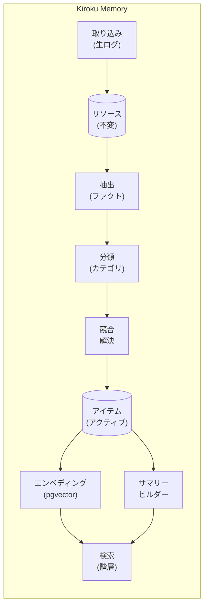

# Kiroku Memory

> AI エージェント向け階層検索メモリシステム

<p align="center">
  
</p>

[](https://www.python.org/downloads/)
[](https://fastapi.tiangolo.com/)
[](https://www.postgresql.org/)
[](https://opensource.org/licenses/MIT)

**言語**: [English](README.md) | [繁體中文](README.zh-TW.md) | [日本語](README.ja.md)

AI エージェント向けの本番環境対応メモリシステムです。永続的で進化するメモリと階層的な検索を実装しています。Rohit の「How to Build an Agent That Never Forgets」とコミュニティのフィードバックに基づいて構築されています。

## なぜこのプロジェクト？

従来の RAG（Retrieval-Augmented Generation）は、大規模運用時に根本的な課題に直面します：

- **意味的類似性 ≠ 事実の正確性**：エンベディングは類似性を捉えますが、正確性は捉えません
- **時間的コンテキストの欠如**：「ユーザーは以前 A が好きだったが、今は B を好む」という状況を処理できません
- **メモリの矛盾**：時間とともに蓄積された情報が矛盾する可能性があります
- **スケーラビリティの問題**：数万件のメモリで検索パフォーマンスが低下します

本システムは **Hybrid Memory Stack（ハイブリッドメモリスタック）** アーキテクチャでこれらの課題に対処します。

## 機能

- **追記専用の生ログ**：不変の来歴追跡
- **アトミックファクト抽出**：LLM による構造化ファクト抽出（主語-述語-目的語）
- **カテゴリベースの整理**：進化するサマリーを持つ 6 つのデフォルトカテゴリ
- **階層的検索**：まずサマリー、必要に応じてファクトに掘り下げ
- **競合解決**：矛盾するファクトの自動検出とアーカイブ
- **時間減衰**：メモリの信頼度が時間とともに指数関数的に減衰
- **ベクトル検索**：pgvector による意味的類似性検索
- **ナレッジグラフ**：エンティティ間の関係マッピング
- **スケジュールメンテナンス**：毎日、毎週、毎月のメンテナンスジョブ
- **本番環境対応**：構造化ログ、メトリクス、ヘルスチェック

## アーキテクチャ



## クイックスタート

### 前提条件

- Python 3.11+
- Docker（PostgreSQL + pgvector 用）
- OpenAI API キー

### インストール

```bash
# リポジトリをクローン
git clone https://github.com/yelban/kiroku-memory.git
cd kiroku-memory

# uv で依存関係をインストール
uv sync

# 環境変数ファイルをコピー
cp .env.example .env

# .env を編集して OPENAI_API_KEY を設定
```

### サービスの起動

```bash
# PostgreSQL + pgvector を起動
docker compose up -d

# API サーバーを起動
uv run uvicorn kiroku_memory.api:app --reload

# API は http://localhost:8000 で利用可能
```

### インストールの確認

```bash
# ヘルスチェック
curl http://localhost:8000/health
# 期待される応答: {"status":"ok","version":"0.1.0"}

# 詳細なヘルスステータス
curl http://localhost:8000/health/detailed
```

## 使用方法

### 基本的なワークフロー

#### 1. メッセージの取り込み

```bash
curl -X POST http://localhost:8000/ingest \
  -H "Content-Type: application/json" \
  -d '{
    "content": "私の名前は田中で、Google でソフトウェアエンジニアとして働いています。Neovim を使うのが好きです。",
    "source": "user:tanaka",
    "metadata": {"channel": "chat"}
  }'
```

#### 2. ファクトの抽出

```bash
curl -X POST http://localhost:8000/extract \
  -H "Content-Type: application/json" \
  -d '{"resource_id": "YOUR_RESOURCE_ID"}'
```

これにより以下のような構造化ファクトが抽出されます：
- `田中` `勤務先` `Google`（カテゴリ：facts）
- `田中` `職業` `ソフトウェアエンジニア`（カテゴリ：facts）
- `田中` `好み` `Neovim`（カテゴリ：preferences）

#### 3. サマリーの生成

```bash
curl -X POST http://localhost:8000/summarize
```

#### 4. メモリの検索

```bash
# 階層的検索（サマリー + アイテム）
curl "http://localhost:8000/retrieve?query=田中さんの仕事は何ですか"

# エージェントプロンプト用のコンテキストを取得
curl "http://localhost:8000/context"
```

### API エンドポイント

#### コアエンドポイント

| メソッド | パス | 説明 |
|----------|------|------|
| POST | `/ingest` | 生メッセージをメモリに取り込み |
| GET | `/resources` | 生リソースの一覧 |
| GET | `/resources/{id}` | 特定のリソースを取得 |
| GET | `/retrieve` | 階層的メモリ検索 |
| GET | `/items` | 抽出されたアイテムの一覧 |
| GET | `/categories` | カテゴリとサマリーの一覧 |

#### インテリジェンスエンドポイント

| メソッド | パス | 説明 |
|----------|------|------|
| POST | `/extract` | リソースからファクトを抽出 |
| POST | `/process` | 保留中のリソースをバッチ処理 |
| POST | `/summarize` | カテゴリサマリーを構築 |
| GET | `/context` | エージェントプロンプト用のメモリコンテキストを取得 |

#### メンテナンスエンドポイント

| メソッド | パス | 説明 |
|----------|------|------|
| POST | `/jobs/nightly` | 毎日の統合を実行 |
| POST | `/jobs/weekly` | 毎週のメンテナンスを実行 |
| POST | `/jobs/monthly` | 毎月の再インデックスを実行 |

#### オブザーバビリティエンドポイント

| メソッド | パス | 説明 |
|----------|------|------|
| GET | `/health` | 基本的なヘルスチェック |
| GET | `/health/detailed` | 詳細なヘルスステータス |
| GET | `/metrics` | アプリケーションメトリクス |
| POST | `/metrics/reset` | メトリクスをリセット |

## 統合

### Claude Code との統合（MCP サーバー）

Claude Code と統合するための MCP サーバーを作成：

```python
# memory_mcp.py
from mcp.server import Server
from kiroku_memory.db.database import get_session
from kiroku_memory.summarize import get_tiered_context

app = Server("memory-system")

@app.tool("memory_context")
async def memory_context():
    async with get_session() as session:
        return await get_tiered_context(session)
```

`~/.claude/mcp.json` で設定：

```json
{
  "mcpServers": {
    "memory": {
      "command": "uv",
      "args": ["run", "python", "memory_mcp.py"]
    }
  }
}
```

### チャットボットとの統合（Telegram/LINE）

```javascript
const MEMORY_API = "http://localhost:8000";

// 応答前にメモリコンテキストを取得
async function getMemoryContext(userId) {
  const response = await fetch(`${MEMORY_API}/context`);
  const data = await response.json();
  return data.context;
}

// 会話後に重要な情報を保存
async function saveToMemory(userId, content) {
  await fetch(`${MEMORY_API}/ingest`, {
    method: "POST",
    headers: { "Content-Type": "application/json" },
    body: JSON.stringify({
      content,
      source: `bot:${userId}`
    })
  });
}

// ボットで使用
const memoryContext = await getMemoryContext(userId);
const enhancedPrompt = `${memoryContext}\n\n${SYSTEM_PROMPT}`;
```

詳細な例については [Integration Guide](docs/integration-guide.md) を参照してください。

## メンテナンス

### スケジュールジョブ

自動メンテナンス用に cron ジョブを設定：

```bash
# 毎日：重複をマージ、ホットなメモリを昇格
0 2 * * * curl -X POST http://localhost:8000/jobs/nightly

# 毎週：時間減衰を適用、古いアイテムをアーカイブ
0 3 * * 0 curl -X POST http://localhost:8000/jobs/weekly

# 毎月：エンベディングとナレッジグラフを再構築
0 4 1 * * curl -X POST http://localhost:8000/jobs/monthly
```

### 時間減衰

メモリは設定可能な半減期（デフォルト：30日）で指数関数的に減衰します：

```python
def time_decay_score(created_at, half_life_days=30):
    age_days = (now - created_at).days
    return 0.5 ** (age_days / half_life_days)
```

## 設定

### 環境変数

| 変数 | デフォルト | 説明 |
|------|------------|------|
| `DATABASE_URL` | `postgresql+asyncpg://...` | データベース接続文字列 |
| `OPENAI_API_KEY` | （必須） | OpenAI API キー |
| `EMBEDDING_MODEL` | `text-embedding-3-small` | OpenAI エンベディングモデル |
| `EMBEDDING_DIMENSIONS` | `1536` | ベクトル次元 |
| `REDIS_URL` | `redis://localhost:6379/0` | Redis URL（将来使用） |
| `DEBUG` | `false` | デバッグモードを有効化 |

## プロジェクト構造

```
.
├── kiroku_memory/
│   ├── api.py              # FastAPI エンドポイント
│   ├── ingest.py           # リソースの取り込み
│   ├── extract.py          # ファクト抽出（LLM）
│   ├── classify.py         # カテゴリ分類
│   ├── conflict.py         # 競合解決
│   ├── summarize.py        # サマリー生成
│   ├── embedding.py        # ベクトル検索
│   ├── observability.py    # メトリクス＆ログ
│   ├── db/
│   │   ├── models.py       # SQLAlchemy モデル
│   │   ├── schema.sql      # PostgreSQL スキーマ
│   │   ├── database.py     # 接続管理
│   │   └── config.py       # 設定
│   └── jobs/
│       ├── nightly.py      # 毎日のメンテナンス
│       ├── weekly.py       # 毎週のメンテナンス
│       └── monthly.py      # 毎月のメンテナンス
├── tests/
│   ├── test_models.py
│   └── load/
│       └── test_retrieval.py
├── docs/
│   ├── architecture.md
│   ├── development-journey.md
│   ├── user-guide.md
│   └── integration-guide.md
├── docker-compose.yml
├── pyproject.toml
└── README.md
```

## ドキュメント

- [Architecture Design](docs/architecture.md) - システムアーキテクチャと設計決定
- [Development Journey](docs/development-journey.md) - アイデアから実装まで
- [User Guide](docs/user-guide.md) - 総合的な使用ガイド
- [Integration Guide](docs/integration-guide.md) - Claude Code、Codex、チャットボットとの統合

## 技術スタック

- **言語**：Python 3.11+
- **フレームワーク**：FastAPI + asyncio
- **データベース**：PostgreSQL 16 + pgvector
- **ORM**：SQLAlchemy 2.x
- **エンベディング**：OpenAI text-embedding-3-small
- **パッケージマネージャー**：uv

## コントリビューション

コントリビューションを歓迎します！プルリクエストを送信する前に、コントリビューションガイドラインをお読みください。

## ライセンス

このプロジェクトは MIT ライセンスの下でライセンスされています - 詳細は [LICENSE](LICENSE) ファイルを参照してください。

## 謝辞

- Rohit (@rohit4verse) のオリジナル記事「How to Build an Agent That Never Forgets」
- MemoraX チームのオープンソース実装リファレンス
- Rishi Sood の LC-OS Context Engineering 論文
- コミュニティの貴重なフィードバックと提案

## 関連プロジェクト

- [MemoraX](https://github.com/MemoraXLabs/MemoraX) - エージェントメモリの別の実装
- [mem0](https://github.com/mem0ai/mem0) - AI アプリケーション用のメモリレイヤー
