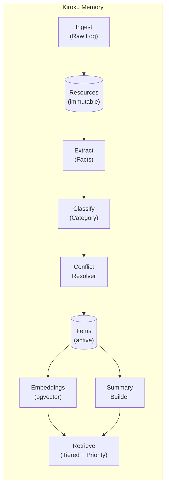

# Kiroku Memory

> Tiered Retrieval Memory System for AI Agents

<p align="center">
  
</p>

[](https://www.python.org/downloads/)
[](https://fastapi.tiangolo.com/)
[](https://www.postgresql.org/)
[](https://opensource.org/licenses/MIT)

**Language**: [English](README.md) | [繁體中文](README.zh-TW.md) | [日本語](README.ja.md)

A production-ready memory system for AI agents that implements persistent, evolving memory with tiered retrieval. Built on the principles from Rohit's "How to Build an Agent That Never Forgets" and community feedback.

## Why This Project?

Traditional RAG (Retrieval-Augmented Generation) faces fundamental challenges at scale:

- **Semantic similarity ≠ Factual truth**: Embeddings capture similarity, not correctness
- **No temporal context**: Cannot handle "user liked A before, now prefers B"
- **Memory contradictions**: Information accumulated over time may conflict
- **Scalability issues**: Retrieval performance degrades with tens of thousands of memories

This system addresses these challenges with a **Hybrid Memory Stack** architecture.

## Why Memory Matters: Expert Perspectives

Leading researchers in AI agents and cognitive science emphasize why persistent memory is crucial:

### Lilian Weng (OpenAI Research Scientist)

In her influential article *"LLM Powered Autonomous Agents"*, she identifies memory as a core component:

> Memory enables agents to go beyond stateless interactions, accumulating knowledge across sessions.

Kiroku implements this through **Tiered Retrieval** — summaries first, then drill-down — avoiding the semantic drift problem of naive RAG.

### Harrison Chase (LangChain Founder)

He outlines three layers of agent memory: **Episodic** (events), **Semantic** (facts), **Procedural** (skills).

| LangChain Concept | Kiroku Implementation |
|-------------------|----------------------|
| Episodic | `events` category |
| Semantic | `facts`, `preferences` categories |
| Procedural | `skills` category |

Plus: **Conflict Resolution** automatically detects contradicting facts, and **Cross-project Sharing** via `global:user` scope.

### Daniel Kahneman (Nobel Laureate, Cognitive Psychology)

From *"Thinking, Fast and Slow"* — System 1 (intuition) vs System 2 (analysis).

**Kiroku's implementation:**

| Mode | Feature | Benefit |
|------|----------------|---------|
| System 1 | Auto-load context | Claude "knows" you instantly |
| System 2 | `/remember` command | Explicit marking of important info |

**Real impact**: No more repeating "I prefer uv for Python" every session.

### The Core Value

These experts converge on one insight: **Memory transforms AI from a tool into a partner**.

- **Continuity** — Conversations aren't isolated islands
- **Personalization** — AI truly "knows" you
- **Efficiency** — Eliminates cognitive overhead of re-explaining context
- **Evolution** — Memory accumulates, making AI smarter over time

## Features

- **Append-only Raw Logs**: Immutable provenance tracking
- **Atomic Facts Extraction**: LLM-powered structured fact extraction (subject-predicate-object)
- **Category-based Organization**: 6 default categories with evolving summaries
- **Tiered Retrieval**: Summaries first, drill down to facts when needed
- **Conflict Resolution**: Automatic detection and archival of contradicting facts
- **Time Decay**: Exponential decay of memory confidence over time
- **Vector Search**: pgvector-powered semantic similarity search
- **Knowledge Graph**: Relationship mapping between entities
- **Scheduled Maintenance**: Nightly, weekly, and monthly maintenance jobs
- **Production Ready**: Structured logging, metrics, and health checks

## Architecture



## Quick Start

### Prerequisites

- Python 3.11+
- Docker (for PostgreSQL + pgvector)
- OpenAI API Key

### Installation

```bash
# Clone the repository
git clone https://github.com/yelban/kiroku-memory.git
cd kiroku-memory

# Install dependencies using uv
uv sync

# Copy environment file
cp .env.example .env

# Edit .env and set your OPENAI_API_KEY
```

### Start Services

```bash
# Start PostgreSQL with pgvector
docker compose up -d

# Start the API server
uv run uvicorn kiroku_memory.api:app --reload

# The API will be available at http://localhost:8000
```

### Verify Installation

```bash
# Health check
curl http://localhost:8000/health
# Expected: {"status":"ok","version":"0.1.0"}

# Detailed health status
curl http://localhost:8000/health/detailed
```

## Usage

### Basic Workflow

#### 1. Ingest a Message

```bash
curl -X POST http://localhost:8000/ingest \
  -H "Content-Type: application/json" \
  -d '{
    "content": "My name is John and I work at Google as a software engineer. I prefer using Neovim.",
    "source": "user:john",
    "metadata": {"channel": "chat"}
  }'
```

#### 2. Extract Facts

```bash
curl -X POST http://localhost:8000/extract \
  -H "Content-Type: application/json" \
  -d '{"resource_id": "YOUR_RESOURCE_ID"}'
```

This extracts structured facts like:
- `John` `works at` `Google` (category: facts)
- `John` `is a` `software engineer` (category: facts)
- `John` `prefers` `Neovim` (category: preferences)

#### 3. Generate Summaries

```bash
curl -X POST http://localhost:8000/summarize
```

#### 4. Retrieve Memories

```bash
# Tiered retrieval (summaries + items)
curl "http://localhost:8000/retrieve?query=What%20does%20John%20do"

# Get context for agent prompt
curl "http://localhost:8000/context"
```

### API Endpoints

#### Core Endpoints

| Method | Path | Description |
|--------|------|-------------|
| POST | `/ingest` | Ingest raw message into memory |
| GET | `/resources` | List raw resources |
| GET | `/resources/{id}` | Get specific resource |
| GET | `/retrieve` | Tiered memory retrieval |
| GET | `/items` | List extracted items |
| GET | `/categories` | List categories with summaries |

#### Intelligence Endpoints

| Method | Path | Description |
|--------|------|-------------|
| POST | `/extract` | Extract facts from resource |
| POST | `/process` | Batch process pending resources |
| POST | `/summarize` | Build category summaries |
| GET | `/context` | Get memory context for agent prompt |

#### Maintenance Endpoints

| Method | Path | Description |
|--------|------|-------------|
| POST | `/jobs/nightly` | Run nightly consolidation |
| POST | `/jobs/weekly` | Run weekly maintenance |
| POST | `/jobs/monthly` | Run monthly re-indexing |

#### Observability Endpoints

| Method | Path | Description |
|--------|------|-------------|
| GET | `/health` | Basic health check |
| GET | `/health/detailed` | Detailed health status |
| GET | `/metrics` | Application metrics |
| POST | `/metrics/reset` | Reset metrics |

## Integration

### With Claude Code (Recommended)

#### Option 1: Plugin Marketplace (Easiest)

```bash
# Step 1: Add the marketplace
/plugin marketplace add https://github.com/yelban/kiroku-memory.git

# Step 2: Install the plugin
/plugin install kiroku-memory
```

#### Option 2: npx Skills CLI

```bash
# Vercel Skills CLI
npx skills add yelban/kiroku-memory

# Or add-skill CLI
npx add-skill yelban/kiroku-memory

# Or OpenSkills
npx openskills install yelban/kiroku-memory
```

#### Option 3: Manual Installation

```bash
# One-click install
curl -fsSL https://raw.githubusercontent.com/yelban/kiroku-memory/main/skill/assets/install.sh | bash

# Or clone and install
git clone https://github.com/yelban/kiroku-memory.git
cd kiroku-memory/skill/assets && ./install.sh
```

After installation, restart Claude Code and use:

```bash
/remember 用戶偏好深色模式          # Save memory
/recall 編輯器偏好                  # Search memories
/memory-status                      # Check status
```

**Features:**
- **Auto-load**: SessionStart hook injects memory context
- **Smart-save**: Stop hook automatically saves important facts
- **Priority ordering**: preferences > facts > goals (hybrid static+dynamic weights)
- **Smart truncation**: Never truncates mid-category, maintains completeness
- **Cross-project**: Global + project-specific memory scopes

#### Verify Hooks Are Working

When hooks are working correctly, you'll see this at conversation start:

```
SessionStart:startup hook success: <kiroku-memory>
## User Memory Context

### Preferences
...
</kiroku-memory>
```

This confirms:
- ✅ SessionStart hook executed successfully
- ✅ API service is connected
- ✅ Memory context has been injected

If memory content is empty (only category headers), no memories have been stored yet. Use `/remember` to store manually.

#### Auto-Save Conditions

Stop Hook analyzes conversations and only saves content matching these patterns:

| Pattern Type | Examples | Min Weighted Length |
|-------------|----------|---------------------|
| Preferences | `I prefer...`, `I like...` | 10 |
| Decisions | `decided to use...`, `chosen...` | 10 |
| Settings | `config...`, `project uses...` | 10 |
| Facts | `work at...`, `live in...` | 10 |
| No pattern | General content | 35 |

> **Weighted length**: CJK chars × 2.5 + other chars × 1

**Filtered out (noise):**
- Short responses: `OK`, `好的`, `Thanks`
- Questions: `What is...`, `How to...`
- Errors: `error`, `failed`

See [Claude Code Integration Guide](docs/claude-code-integration.md) for details.

### With MCP Server (Advanced)

For custom MCP server integration:

```python
# memory_mcp.py
from mcp.server import Server
from kiroku_memory.db.database import get_session
from kiroku_memory.summarize import get_tiered_context

app = Server("memory-system")

@app.tool("memory_context")
async def memory_context():
    async with get_session() as session:
        return await get_tiered_context(session)
```

Configure in `~/.claude/mcp.json`:

```json
{
  "mcpServers": {
    "memory": {
      "command": "uv",
      "args": ["run", "python", "memory_mcp.py"]
    }
  }
}
```

### With Chat Bots (Telegram/LINE)

```javascript
const MEMORY_API = "http://localhost:8000";

// Get memory context before responding
async function getMemoryContext(userId) {
  const response = await fetch(`${MEMORY_API}/context`);
  const data = await response.json();
  return data.context;
}

// Save important information after conversation
async function saveToMemory(userId, content) {
  await fetch(`${MEMORY_API}/ingest`, {
    method: "POST",
    headers: { "Content-Type": "application/json" },
    body: JSON.stringify({
      content,
      source: `bot:${userId}`
    })
  });
}

// Use in your bot
const memoryContext = await getMemoryContext(userId);
const enhancedPrompt = `${memoryContext}\n\n${SYSTEM_PROMPT}`;
```

See [Integration Guide](docs/integration-guide.md) for detailed examples.

## Maintenance

### Scheduled Jobs

Set up cron jobs for automatic maintenance:

```bash
# Nightly: Merge duplicates, promote hot memories
0 2 * * * curl -X POST http://localhost:8000/jobs/nightly

# Weekly: Apply time decay, archive old items
0 3 * * 0 curl -X POST http://localhost:8000/jobs/weekly

# Monthly: Rebuild embeddings and knowledge graph
0 4 1 * * curl -X POST http://localhost:8000/jobs/monthly
```

### Time Decay

Memories decay exponentially with a configurable half-life (default: 30 days):

```python
def time_decay_score(created_at, half_life_days=30):
    age_days = (now - created_at).days
    return 0.5 ** (age_days / half_life_days)
```

## Configuration

### Environment Variables

| Variable | Default | Description |
|----------|---------|-------------|
| `DATABASE_URL` | `postgresql+asyncpg://...` | Database connection string |
| `OPENAI_API_KEY` | (required) | OpenAI API key for embeddings |
| `EMBEDDING_MODEL` | `text-embedding-3-small` | OpenAI embedding model |
| `EMBEDDING_DIMENSIONS` | `1536` | Vector dimensions |
| `REDIS_URL` | `redis://localhost:6379/0` | Redis URL (for future use) |
| `DEBUG` | `false` | Enable debug mode |

## Project Structure

```
.
├── kiroku_memory/          # Core Python package
│   ├── api.py              # FastAPI endpoints
│   ├── ingest.py           # Resource ingestion
│   ├── extract.py          # Fact extraction (LLM)
│   ├── classify.py         # Category classification
│   ├── conflict.py         # Conflict resolution
│   ├── summarize.py        # Summary generation
│   ├── embedding.py        # Vector search
│   ├── observability.py    # Metrics & logging
│   ├── db/                 # Database layer
│   └── jobs/               # Maintenance jobs
├── skill/                  # Claude Code Skill
│   ├── SKILL.md            # Skill documentation (EN)
│   ├── SKILL.zh-TW.md      # 繁體中文
│   ├── SKILL.ja.md         # 日本語
│   ├── scripts/            # Commands & hooks
│   ├── references/         # Reference docs
│   └── assets/             # Install script
├── tests/
├── docs/
├── docker-compose.yml
├── pyproject.toml
└── README.md
```

## Documentation

- [Architecture Design](docs/architecture.md) - System architecture and design decisions
- [Development Journey](docs/development-journey.md) - From idea to implementation
- [User Guide](docs/user-guide.md) - Comprehensive usage guide
- [Integration Guide](docs/integration-guide.md) - Integration with chat bots and custom agents
- [Claude Code Integration](docs/claude-code-integration.md) - Claude Code skill setup and usage
- [Renaming Changelog](docs/renaming-changelog.md) - Project renaming history

## Tech Stack

- **Language**: Python 3.11+
- **Framework**: FastAPI + asyncio
- **Database**: PostgreSQL 16 + pgvector
- **ORM**: SQLAlchemy 2.x
- **Embeddings**: OpenAI text-embedding-3-small
- **Package Manager**: uv

## Contributing

Contributions are welcome! Please read our contributing guidelines before submitting a pull request.

## License

This project is licensed under the MIT License - see the [LICENSE](LICENSE) file for details.

## Acknowledgments

- Rohit (@rohit4verse) for the original "How to Build an Agent That Never Forgets" article
- MemoraX team for open-source implementation reference
- Rishi Sood for LC-OS Context Engineering papers
- The community for valuable feedback and suggestions

## Related Projects

- [MemoraX](https://github.com/MemoraXLabs/MemoraX) - Another implementation of agent memory
- [mem0](https://github.com/mem0ai/mem0) - Memory layer for AI applications
