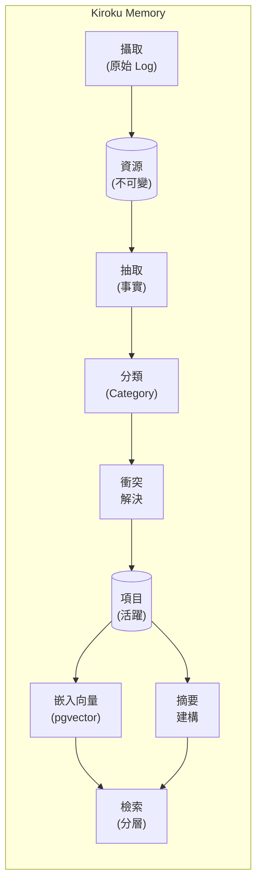

# Kiroku Memory

> AI Agent 分層檢索記憶系統

<p align="center">
  
</p>

[](https://www.python.org/downloads/)
[](https://fastapi.tiangolo.com/)
[](https://www.postgresql.org/)
[](https://opensource.org/licenses/MIT)

**語言**: [English](README.md) | [繁體中文](README.zh-TW.md) | [日本語](README.ja.md)

一個可用於生產環境的 AI Agent 記憶系統，實現持久化、可演進的記憶與分層檢索功能。基於 Rohit 的「How to Build an Agent That Never Forgets」文章及社群回饋所設計。

## 為什麼需要這個專案？

傳統 RAG（Retrieval-Augmented Generation）在大規模應用時面臨根本性挑戰：

- **語義相似 ≠ 事實正確**：Embeddings 捕捉的是相似度，而非正確性
- **缺乏時間脈絡**：無法處理「用戶以前喜歡 A，現在喜歡 B」的情境
- **記憶矛盾**：隨時間累積的資訊可能相互衝突
- **擴展性問題**：當記憶達到數萬條時，檢索效能急劇下降

本系統透過 **Hybrid Memory Stack（混合記憶堆疊）** 架構解決這些挑戰。

## 功能特點

- **只增不改的原始日誌**：不可變的來源追蹤
- **原子事實抽取**：LLM 驅動的結構化事實抽取（主詞-謂詞-受詞）
- **分類式組織**：6 個預設分類，帶有可演進的摘要
- **分層檢索**：摘要優先，按需深入到事實
- **衝突解決**：自動偵測並封存矛盾的事實
- **時間衰減**：記憶信心度隨時間指數衰減
- **向量搜尋**：pgvector 驅動的語義相似度搜尋
- **知識圖譜**：實體間的關係映射
- **排程維護**：每日、每週、每月維護任務
- **生產就緒**：結構化日誌、指標監控、健康檢查

## 架構



## 快速開始

### 環境需求

- Python 3.11+
- Docker（用於 PostgreSQL + pgvector）
- OpenAI API Key

### 安裝

```bash
# 複製儲存庫
git clone https://github.com/yelban/kiroku-memory.git
cd kiroku-memory

# 使用 uv 安裝依賴
uv sync

# 複製環境變數檔案
cp .env.example .env

# 編輯 .env 並設定 OPENAI_API_KEY
```

### 啟動服務

```bash
# 啟動 PostgreSQL + pgvector
docker compose up -d

# 啟動 API 伺服器
uv run uvicorn kiroku_memory.api:app --reload

# API 將運行在 http://localhost:8000
```

### 驗證安裝

```bash
# 健康檢查
curl http://localhost:8000/health
# 預期回應: {"status":"ok","version":"0.1.0"}

# 詳細健康狀態
curl http://localhost:8000/health/detailed
```

## 使用方式

### 基本工作流程

#### 1. 攝取訊息

```bash
curl -X POST http://localhost:8000/ingest \
  -H "Content-Type: application/json" \
  -d '{
    "content": "我叫小明，在 Google 當軟體工程師。我偏好使用 Neovim。",
    "source": "user:xiaoming",
    "metadata": {"channel": "chat"}
  }'
```

#### 2. 抽取事實

```bash
curl -X POST http://localhost:8000/extract \
  -H "Content-Type: application/json" \
  -d '{"resource_id": "你的_RESOURCE_ID"}'
```

這會抽取出結構化事實，例如：
- `小明` `工作於` `Google`（分類：facts）
- `小明` `是` `軟體工程師`（分類：facts）
- `小明` `偏好` `Neovim`（分類：preferences）

#### 3. 生成摘要

```bash
curl -X POST http://localhost:8000/summarize
```

#### 4. 檢索記憶

```bash
# 分層檢索（摘要 + 項目）
curl "http://localhost:8000/retrieve?query=小明做什麼工作"

# 取得 Agent prompt 用的上下文
curl "http://localhost:8000/context"
```

### API 端點

#### 核心端點

| 方法 | 路徑 | 說明 |
|------|------|------|
| POST | `/ingest` | 攝取原始訊息 |
| GET | `/resources` | 列出原始資源 |
| GET | `/resources/{id}` | 取得特定資源 |
| GET | `/retrieve` | 分層記憶檢索 |
| GET | `/items` | 列出抽取的項目 |
| GET | `/categories` | 列出分類及摘要 |

#### 智慧端點

| 方法 | 路徑 | 說明 |
|------|------|------|
| POST | `/extract` | 從資源抽取事實 |
| POST | `/process` | 批次處理待處理資源 |
| POST | `/summarize` | 建立分類摘要 |
| GET | `/context` | 取得 Agent prompt 用的記憶上下文 |

#### 維護端點

| 方法 | 路徑 | 說明 |
|------|------|------|
| POST | `/jobs/nightly` | 執行每日整合 |
| POST | `/jobs/weekly` | 執行每週維護 |
| POST | `/jobs/monthly` | 執行每月重建索引 |

#### 可觀測性端點

| 方法 | 路徑 | 說明 |
|------|------|------|
| GET | `/health` | 基本健康檢查 |
| GET | `/health/detailed` | 詳細健康狀態 |
| GET | `/metrics` | 應用程式指標 |
| POST | `/metrics/reset` | 重設指標 |

## 整合

### 與 Claude Code 整合（推薦）

#### 方式一：Plugin Marketplace（最簡單）

```bash
# 步驟 1：新增市集
/plugin marketplace add https://github.com/yelban/kiroku-memory.git

# 步驟 2：安裝外掛
/plugin install kiroku-memory
```

#### 方式二：npx Skills CLI

```bash
# Vercel Skills CLI
npx skills add yelban/kiroku-memory

# 或 add-skill CLI
npx add-skill yelban/kiroku-memory

# 或 OpenSkills
npx openskills install yelban/kiroku-memory
```

#### 方式三：手動安裝

```bash
# 一鍵安裝
curl -fsSL https://raw.githubusercontent.com/yelban/kiroku-memory/main/skill/assets/install.sh | bash

# 或 clone 後安裝
git clone https://github.com/yelban/kiroku-memory.git
cd kiroku-memory/skill/assets && ./install.sh
```

安裝後重啟 Claude Code，即可使用：

```bash
/remember 用戶偏好深色模式          # 儲存記憶
/recall 編輯器偏好                  # 搜尋記憶
/memory-status                      # 檢查狀態
```

**功能特色：**
- **自動載入**：SessionStart hook 自動注入記憶上下文
- **智慧儲存**：Stop hook 自動儲存重要事實
- **跨專案**：全域記憶 + 專案記憶範圍

#### 驗證 Hooks 運作狀態

當 Hooks 正常運作時，對話開始會出現：

```
SessionStart:startup hook success: <kiroku-memory>
## User Memory Context

### Preferences
...
</kiroku-memory>
```

這表示：
- ✅ SessionStart hook 成功執行
- ✅ API 服務已連接
- ✅ 記憶上下文已注入

若記憶內容為空（只有分類標題），代表尚未儲存任何記憶，可用 `/remember` 手動儲存。

#### 自動儲存條件

Stop Hook 會分析對話內容，只儲存符合以下模式的內容：

| 模式類型 | 範例 | 最小加權長度 |
|---------|------|-------------|
| 偏好 | `我喜歡...`、`偏好...` | 10 |
| 決定 | `決定使用...`、`選擇...` | 10 |
| 設定 | `專案使用...`、`架構決定...` | 10 |
| 事實 | `工作於...`、`住在...` | 10 |
| 無模式 | 一般內容 | 35 |

> **加權長度計算**：CJK 字元 × 2.5 + 其他字元 × 1

**會過濾掉的雜訊：**
- 短回覆：`好的`、`OK`、`謝謝`
- 問句：`什麼是...`、`怎麼做...`
- 錯誤訊息：`錯誤`、`失敗`

詳見 [Claude Code 整合指南](docs/claude-code-integration.md)。

### 與 MCP Server 整合（進階）

建立自訂 MCP 伺服器：

```python
# memory_mcp.py
from mcp.server import Server
from kiroku_memory.db.database import get_session
from kiroku_memory.summarize import get_tiered_context

app = Server("memory-system")

@app.tool("memory_context")
async def memory_context():
    async with get_session() as session:
        return await get_tiered_context(session)
```

在 `~/.claude/mcp.json` 中設定：

```json
{
  "mcpServers": {
    "memory": {
      "command": "uv",
      "args": ["run", "python", "memory_mcp.py"]
    }
  }
}
```

### 與聊天機器人整合（Telegram/LINE）

```javascript
const MEMORY_API = "http://localhost:8000";

// 回覆前取得記憶上下文
async function getMemoryContext(userId) {
  const response = await fetch(`${MEMORY_API}/context`);
  const data = await response.json();
  return data.context;
}

// 對話後儲存重要資訊
async function saveToMemory(userId, content) {
  await fetch(`${MEMORY_API}/ingest`, {
    method: "POST",
    headers: { "Content-Type": "application/json" },
    body: JSON.stringify({
      content,
      source: `bot:${userId}`
    })
  });
}

// 在機器人中使用
const memoryContext = await getMemoryContext(userId);
const enhancedPrompt = `${memoryContext}\n\n${SYSTEM_PROMPT}`;
```

詳細範例請參閱 [整合指南](docs/integration-guide.md)。

## 維護

### 排程任務

設定 cron 任務進行自動維護：

```bash
# 每日：合併重複、提升熱門記憶
0 2 * * * curl -X POST http://localhost:8000/jobs/nightly

# 每週：套用時間衰減、封存舊項目
0 3 * * 0 curl -X POST http://localhost:8000/jobs/weekly

# 每月：重建嵌入向量和知識圖譜
0 4 1 * * curl -X POST http://localhost:8000/jobs/monthly
```

### 時間衰減

記憶會以可設定的半衰期（預設：30 天）指數衰減：

```python
def time_decay_score(created_at, half_life_days=30):
    age_days = (now - created_at).days
    return 0.5 ** (age_days / half_life_days)
```

## 設定

### 環境變數

| 變數 | 預設值 | 說明 |
|------|--------|------|
| `DATABASE_URL` | `postgresql+asyncpg://...` | 資料庫連線字串 |
| `OPENAI_API_KEY` | （必填） | OpenAI API 金鑰 |
| `EMBEDDING_MODEL` | `text-embedding-3-small` | OpenAI 嵌入模型 |
| `EMBEDDING_DIMENSIONS` | `1536` | 向量維度 |
| `REDIS_URL` | `redis://localhost:6379/0` | Redis URL（未來使用） |
| `DEBUG` | `false` | 啟用除錯模式 |

## 專案結構

```
.
├── kiroku_memory/
│   ├── api.py              # FastAPI 端點
│   ├── ingest.py           # 資源攝取
│   ├── extract.py          # 事實抽取（LLM）
│   ├── classify.py         # 分類器
│   ├── conflict.py         # 衝突解決
│   ├── summarize.py        # 摘要生成
│   ├── embedding.py        # 向量搜尋
│   ├── observability.py    # 指標與日誌
│   ├── db/
│   │   ├── models.py       # SQLAlchemy 模型
│   │   ├── schema.sql      # PostgreSQL 結構
│   │   ├── database.py     # 連線管理
│   │   └── config.py       # 設定
│   └── jobs/
│       ├── nightly.py      # 每日維護
│       ├── weekly.py       # 每週維護
│       └── monthly.py      # 每月維護
├── tests/
│   ├── test_models.py
│   └── load/
│       └── test_retrieval.py
├── docs/
│   ├── architecture.md
│   ├── development-journey.md
│   ├── user-guide.md
│   └── integration-guide.md
├── docker-compose.yml
├── pyproject.toml
└── README.md
```

## 文件

- [架構設計](docs/architecture.md) - 系統架構與設計決策
- [開發歷程](docs/development-journey.md) - 從點子到實作
- [使用者手冊](docs/user-guide.md) - 完整使用指南
- [整合指南](docs/integration-guide.md) - 與 Claude Code、Codex、聊天機器人整合

## 技術棧

- **語言**：Python 3.11+
- **框架**：FastAPI + asyncio
- **資料庫**：PostgreSQL 16 + pgvector
- **ORM**：SQLAlchemy 2.x
- **嵌入向量**：OpenAI text-embedding-3-small
- **套件管理**：uv

## 貢獻

歡迎貢獻！請在提交 pull request 前閱讀我們的貢獻指南。

## 授權

本專案採用 MIT 授權條款 - 詳見 [LICENSE](LICENSE) 檔案。

## 致謝

- Rohit (@rohit4verse) 的原創文章「How to Build an Agent That Never Forgets」
- MemoraX 團隊的開源實作參考
- Rishi Sood 的 LC-OS Context Engineering 論文
- 社群的寶貴回饋與建議

## 相關專案

- [MemoraX](https://github.com/MemoraXLabs/MemoraX) - Agent 記憶的另一種實作
- [mem0](https://github.com/mem0ai/mem0) - AI 應用的記憶層
