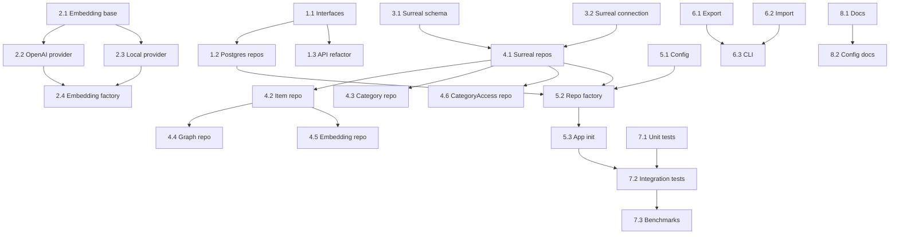

# Plan: SurrealDB Migration (Dual-Track)

**Generated**: February 1, 2026
**Estimated Complexity**: High

## Overview
This plan adds SurrealDB (embedded with SurrealKV) as an alternative backend while keeping PostgreSQL + pgvector. The approach is dual-track: a shared FastAPI layer calls abstract repositories, with backend-specific implementations selected by configuration. Embedding generation is abstracted to support OpenAI (default) and a local sentence-transformers model. Vector storage uses a unified dimension adapter so both backends can index consistently.

Key outcomes:
- Repository pattern decouples persistence from API and pipeline logic.
- SurrealDB schema mirrors current tables, using native RELATE edges.
- Embedding provider abstraction supports OpenAI and local embeddings.
- Environment-based backend switch (postgres or surrealdb).

## Prerequisites
- Python dependencies (uv):
  - surrealdb (official async SDK)
  - sentence-transformers
  - torch (CPU build) or torch-cpu
  - numpy
- SurrealDB embedded runtime availability (verify SDK supports embedded + SurrealKV).
- Update `.env` with backend and embedding settings.
- Create and work on branch `feature/surrealdb`.

## Dual-Track Architecture
- Common domain models live in `kiroku_memory/db/entities.py` (Pydantic or dataclasses).
- Repository interfaces live in `kiroku_memory/db/repositories/base.py`.
- PostgreSQL repos in `kiroku_memory/db/repositories/postgres/` use SQLAlchemy models.
- SurrealDB repos in `kiroku_memory/db/repositories/surrealdb/` use SurrealQL.
- FastAPI and pipelines depend only on repository interfaces.
- Backend selection uses `KIROKU_BACKEND=postgres|surrealdb`.

## Phase 1: Repository Pattern Abstraction
**Goal**: Decouple data access from PostgreSQL-specific code.

### Task 1.1: Define abstract repository interfaces (Complexity: 6/10)
- Location: `kiroku_memory/db/repositories/base.py`
- Define interfaces for Resource, Item, Category, Graph, Embedding, CategoryAccess.
- Add shared domain entities in `kiroku_memory/db/entities.py` to avoid SQLAlchemy model leakage.

Python snippet:
```python
# kiroku_memory/db/repositories/base.py
from abc import ABC, abstractmethod
from typing import Iterable, Optional
from uuid import UUID
from .entities import ResourceEntity, ItemEntity, CategoryEntity, GraphEdgeEntity

class ResourceRepository(ABC):
    @abstractmethod
    async def create(self, resource: ResourceEntity) -> UUID: ...
    @abstractmethod
    async def get(self, resource_id: UUID) -> Optional[ResourceEntity]: ...
    @abstractmethod
    async def list(self, source: Optional[str], since: Optional[str], limit: int) -> list[ResourceEntity]: ...

class ItemRepository(ABC):
    @abstractmethod
    async def create_many(self, items: Iterable[ItemEntity]) -> list[UUID]: ...
    @abstractmethod
    async def get(self, item_id: UUID) -> Optional[ItemEntity]: ...
    @abstractmethod
    async def update_status(self, item_id: UUID, status: str) -> None: ...

class EmbeddingRepository(ABC):
    @abstractmethod
    async def upsert(self, item_id: UUID, vector: list[float]) -> None: ...
    @abstractmethod
    async def search(self, vector: list[float], limit: int, min_sim: float) -> list[tuple[ItemEntity, float]]: ...
```

### Task 1.2: Implement PostgreSQL repositories (Complexity: 7/10)
- Location: `kiroku_memory/db/repositories/postgres/`
- Migrate existing SQLAlchemy logic from `kiroku_memory/embedding.py`, `api.py`, `ingest.py`, `extract.py` into repository classes.
- Use current models in `kiroku_memory/db/models.py` and `kiroku_memory/db/database.py`.

### Task 1.3: Update API layer and pipelines to use repositories (Complexity: 8/10)
- Locations: `kiroku_memory/api.py`, `kiroku_memory/ingest.py`, `kiroku_memory/extract.py`, `kiroku_memory/summarize.py`, `kiroku_memory/conflict.py`, `kiroku_memory/priority.py`, `kiroku_memory/jobs/*.py`
- Replace direct SQLAlchemy queries with repository calls.
- Add dependency injection for repository factory (see Phase 5).

## Phase 2: Embedding Provider Abstraction
**Goal**: Support OpenAI (default) and local embeddings.

### Task 2.1: Define embedding provider interface (Complexity: 5/10)
- Location: `kiroku_memory/embedding/base.py`
- Include model metadata and vector adapter to unify storage dimension.

Python snippet:
```python
# kiroku_memory/embedding/base.py
from abc import ABC, abstractmethod
from dataclasses import dataclass

@dataclass(frozen=True)
class EmbeddingResult:
    vector: list[float]
    model: str
    dimensions: int

class EmbeddingProvider(ABC):
    @property
    @abstractmethod
    def name(self) -> str: ...

    @property
    @abstractmethod
    def dimensions(self) -> int: ...

    @abstractmethod
    async def embed_text(self, text: str) -> EmbeddingResult: ...

    def adapt_vector(self, vector: list[float], target_dim: int) -> list[float]:
        # Pad or truncate to keep storage dimension consistent
        if len(vector) >= target_dim:
            return vector[:target_dim]
        return vector + [0.0] * (target_dim - len(vector))
```

### Task 2.2: OpenAI provider (Complexity: 4/10)
- Location: `kiroku_memory/embedding/openai.py`
- Move logic from `kiroku_memory/embedding.py` to provider class.

### Task 2.3: Local model provider (sentence-transformers) (Complexity: 6/10)
- Location: `kiroku_memory/embedding/local.py`
- Load `sentence-transformers/all-MiniLM-L6-v2` once and embed text.

### Task 2.4: Configuration and factory (Complexity: 5/10)
- Location: `kiroku_memory/embedding/factory.py`
- Environment variables:
  - `KIROKU_EMBEDDING_PROVIDER=openai|local`
  - `KIROKU_EMBEDDING_DIMENSIONS=1536|384` (storage dimension)
  - `KIROKU_EMBEDDING_MODEL` (model name)
- Use adapter to pad local 384-dim vectors to storage dimension (default 1536).

Python snippet:
```python
# kiroku_memory/embedding/factory.py
from .base import EmbeddingProvider
from .openai import OpenAIEmbeddingProvider
from .local import LocalEmbeddingProvider
from .config import embedding_settings

def get_embedding_provider() -> EmbeddingProvider:
    if embedding_settings.provider == "local":
        return LocalEmbeddingProvider(model_name=embedding_settings.model)
    return OpenAIEmbeddingProvider(model_name=embedding_settings.model)
```

## Phase 3: SurrealDB Data Model
**Goal**: Design SurrealQL schema equivalent to PostgreSQL tables.

### Task 3.1: SurrealDB schema design (Complexity: 6/10)
- Location: `kiroku_memory/db/surrealdb/schema.surql`
- Mirror PostgreSQL entities. Use `RELATE` for graph edges.
- Use a single embedding array field with dimension adapter (default 1536).

### Task 3.2: SurrealDB connection manager (Complexity: 7/10)
- Location: `kiroku_memory/db/surrealdb/connection.py`
- Embedded mode with SurrealKV.
- Provide async context manager similar to SQLAlchemy session lifecycle.

Python snippet (API shape to verify with SDK docs):
```python
# kiroku_memory/db/surrealdb/connection.py
from contextlib import asynccontextmanager
from surrealdb import Surreal
from .config import surreal_settings

@asynccontextmanager
async def get_surreal() -> Surreal:
    db = Surreal()
    await db.connect(surreal_settings.url)  # e.g. "file://./data/kiroku"
    await db.use(surreal_settings.namespace, surreal_settings.database)
    try:
        yield db
    finally:
        await db.close()
```

## Phase 4: SurrealDB Repository Implementation
**Goal**: Implement repositories for SurrealDB.

### Task 4.1: Resource repository (Complexity: 6/10)
- Location: `kiroku_memory/db/repositories/surrealdb/resource.py`
- Implement create/get/list using SurrealQL.

### Task 4.2: Item repository (Complexity: 7/10)
- Location: `kiroku_memory/db/repositories/surrealdb/item.py`
- Handle supersedes and status updates.

### Task 4.3: Category repository (Complexity: 5/10)
- Location: `kiroku_memory/db/repositories/surrealdb/category.py`

### Task 4.4: Graph repository (Complexity: 7/10)
- Location: `kiroku_memory/db/repositories/surrealdb/graph.py`
- Use `RELATE item:...->predicate->item:...` with edge properties (weight, created_at).

### Task 4.5: Embedding repository (Complexity: 8/10)
- Location: `kiroku_memory/db/repositories/surrealdb/embedding.py`
- Store embedding on item record or separate embedding table.
- Vector search via `SELECT *, vector::similarity::cosine(...)` or HNSW index query.

### Task 4.6: CategoryAccess repository (Complexity: 4/10)
- Location: `kiroku_memory/db/repositories/surrealdb/category_access.py`

## Phase 5: Backend Selection and Configuration
**Goal**: Environment-based backend switching.

### Task 5.1: Backend configuration (Complexity: 5/10)
- Location: `kiroku_memory/db/config.py`
- Add settings:
  - `backend: str = "postgres"`
  - `surreal_url`, `surreal_namespace`, `surreal_database`, `surreal_path`
  - `embedding_provider`, `embedding_dimensions`, `embedding_model`

### Task 5.2: Repository factory (Complexity: 6/10)
- Location: `kiroku_memory/db/repositories/factory.py`
- Returns repository implementations based on backend setting.

Python snippet:
```python
# kiroku_memory/db/repositories/factory.py
from .base import ResourceRepository
from .postgres.resource import PostgresResourceRepository
from .surrealdb.resource import SurrealResourceRepository
from ..config import settings

def get_resource_repo() -> ResourceRepository:
    if settings.backend == "surrealdb":
        return SurrealResourceRepository()
    return PostgresResourceRepository()
```

### Task 5.3: App initialization (Complexity: 6/10)
- Location: `kiroku_memory/api.py`, `kiroku_memory/db/__init__.py`
- Initialize proper backend on startup and graceful shutdown.

## Phase 6: Migration Tools
**Goal**: Data migration between backends.

### Task 6.1: Export from PostgreSQL (Complexity: 6/10)
- Location: `scripts/migrate/export_postgres.py`
- Export tables to JSONL for streaming import.

### Task 6.2: Import to SurrealDB (Complexity: 7/10)
- Location: `scripts/migrate/import_surrealdb.py`
- Batch insert using `CREATE` or `INSERT` with SurrealQL.

### Task 6.3: Migration CLI (Complexity: 5/10)
- Location: `scripts/migrate_backend.py`
- CLI to export, import, verify counts, and sample queries.

## Phase 7: Testing
**Goal**: Ensure feature parity and performance stability.

### Task 7.1: Repository unit tests (Complexity: 6/10)
- Location: `tests/repositories/`
- Mock embedding provider for deterministic vectors.

### Task 7.2: Integration tests for both backends (Complexity: 7/10)
- Location: `tests/integration/`
- Run with `KIROKU_BACKEND=postgres` and `KIROKU_BACKEND=surrealdb`.

### Task 7.3: Performance benchmarks (Complexity: 6/10)
- Location: `tests/benchmarks/`
- Measure ingest throughput, vector search latency, and graph traversal latency.

## Phase 8: Documentation
**Goal**: Update docs for dual-backend support.

### Task 8.1: README and deployment docs (Complexity: 4/10)
- Locations: `README.md`, `docs/`
- Add backend selection, SurrealDB embedded setup, and migration instructions.

### Task 8.2: Configuration reference (Complexity: 3/10)
- Location: `docs/config.md`
- Document new environment variables and defaults.

## SurrealDB Schema Design
```surql
-- Resources (append-only logs)
DEFINE TABLE resource SCHEMAFULL;
DEFINE FIELD created_at ON resource TYPE datetime DEFAULT time::now();
DEFINE FIELD source ON resource TYPE string;
DEFINE FIELD content ON resource TYPE string;
DEFINE FIELD metadata ON resource TYPE object DEFAULT {};
DEFINE INDEX idx_resource_created_at ON resource FIELDS created_at;
DEFINE INDEX idx_resource_source ON resource FIELDS source;

-- Items (atomic facts with embeddings)
DEFINE TABLE item SCHEMAFULL;
DEFINE FIELD created_at ON item TYPE datetime DEFAULT time::now();
DEFINE FIELD resource ON item TYPE option<record<resource>>;
DEFINE FIELD subject ON item TYPE option<string>;
DEFINE FIELD predicate ON item TYPE option<string>;
DEFINE FIELD object ON item TYPE option<string>;
DEFINE FIELD category ON item TYPE option<string>;
DEFINE FIELD confidence ON item TYPE float DEFAULT 1.0;
DEFINE FIELD status ON item TYPE string DEFAULT 'active' ASSERT $value IN ['active', 'archived', 'deleted'];
DEFINE FIELD supersedes ON item TYPE option<record<item>>;
DEFINE FIELD embedding ON item TYPE option<array<float>>;
DEFINE FIELD embedding_model ON item TYPE option<string>;
DEFINE FIELD embedding_dim ON item TYPE option<int> DEFAULT 1536;
DEFINE INDEX idx_item_category ON item FIELDS category;
DEFINE INDEX idx_item_status ON item FIELDS status;
DEFINE INDEX idx_item_subject ON item FIELDS subject;
DEFINE INDEX idx_item_embedding ON item FIELDS embedding HNSW DIMENSION 1536 DIST COSINE;

-- Categories (summaries)
DEFINE TABLE category SCHEMAFULL;
DEFINE FIELD name ON category TYPE string;
DEFINE FIELD summary ON category TYPE option<string>;
DEFINE FIELD updated_at ON category TYPE datetime DEFAULT time::now();
DEFINE INDEX idx_category_name ON category FIELDS name UNIQUE;

-- Graph edges using native RELATE
-- Example: RELATE item:uuid("...") -> knows -> item:uuid("...") SET weight = 0.8, created_at = time::now();

-- Category accesses
DEFINE TABLE category_access SCHEMAFULL;
DEFINE FIELD category ON category_access TYPE string;
DEFINE FIELD accessed_at ON category_access TYPE datetime DEFAULT time::now();
DEFINE FIELD source ON category_access TYPE string DEFAULT 'context';
DEFINE INDEX idx_access_category ON category_access FIELDS category;
```

## Dependency Graph
Parallelizable groups assume no shared files are being edited simultaneously.



## Potential Risks
- SurrealDB Python SDK embedded support and SurrealKV availability may differ by version.
- Vector search performance and HNSW settings may vary between pgvector and SurrealDB.
- Query parity for graph traversals and complex filters.
- Dual embedding dimensions can complicate index setup and migrations.

## Testing Strategy
- Unit tests for each repository using deterministic embedding vectors.
- Integration tests for CRUD, embedding search, graph edges, and category access.
- Benchmarks for ingest throughput, search latency, and graph traversal.

## Notes on Embedding Storage Strategy
- Default storage dimension remains 1536 for compatibility with existing pgvector schema and HNSW index.
- Local 384-dim vectors are padded to 1536 before storage and query.
- Alternative (optional) strategy: maintain two embedding columns or tables with separate indexes.

